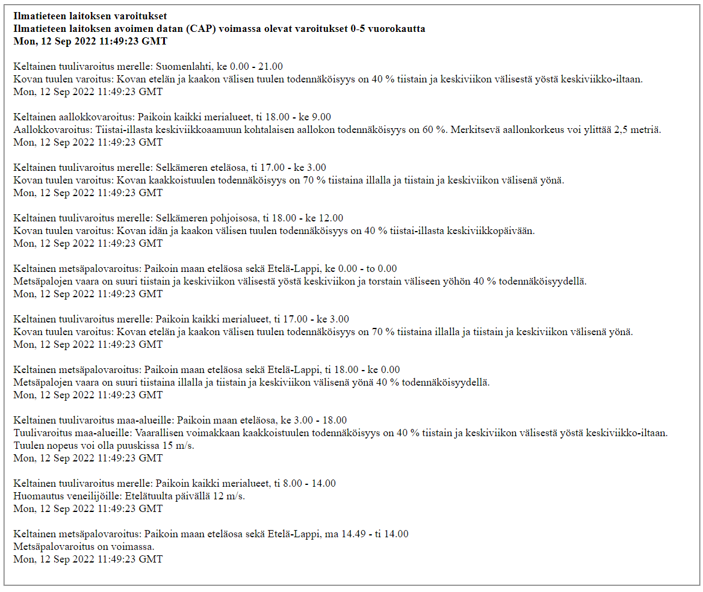

# Saavaroitus

## Description
Simple PHP-page which displays publication date (pubDate), title (title), and description (description) of
all warnings in the RSS-input. The page is suppose to show only the aforementioned data. This was a small school
project, so I'm not gonna do any further development for it.

The project consists of two files:
    
    1.  XML-file using the RSS-feed of Ilmatieteenlaitos (Finnish Meteorological Institute). I'm using this RSS-feed
        because it's available for anyone without any registration. 

    2.  PHP-file, which defines how the XML-file is displayed.

## Installation
The project is installed on a localhost-server using XAMPP. For XAMPP, install the both files in C:\xampp\htdocs\ProjectName .

## Screenshots

